# Exploratory Data Visualization Research Suite

## Overview
End-to-end data visualization and analytics project using Python,
built as part of Data Visualization coursework at JAIN University.

## Tools & Libraries
Python | Matplotlib | Seaborn | Plotly | Dash | Pandas | NumPy

## Projects Included

### 1. Two-Wheeler Sales Analysis (Matplotlib)
Bar chart visualizing sales data for Hero, Honda, and TVS
representing 12.4M+ units across India's top 3 brands.

### 2. Palmer Penguins EDA (Seaborn)
3-chart EDA suite on 344 observations across 7 variables
demonstrating multivariate statistical analysis.

### 3. Interactive Plotly Dashboards
9 interactive charts covering bar, pie, line, scatter, area,
box, histogram, heatmap, and Gantt chart types.

### 4. Dash Interactive Dashboards
3 callback-driven dashboards with real-time filtering across
the Gapminder dataset covering 5 continents and 12 time periods.

## Screenshots

### Matplotlib — Two Wheeler Sales
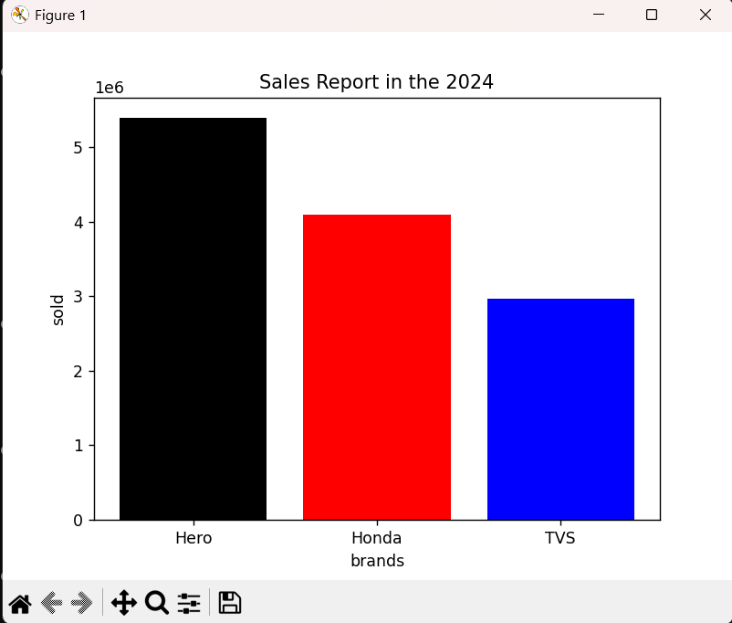

### Seaborn — Palmer Penguins EDA
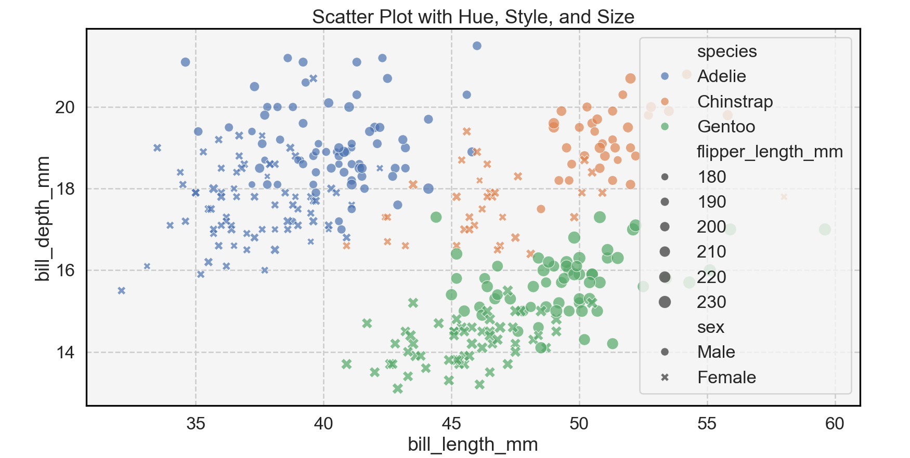
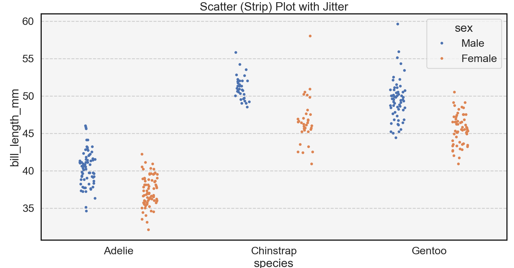
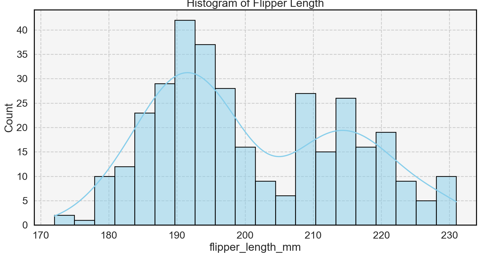

### Plotly — Interactive Charts
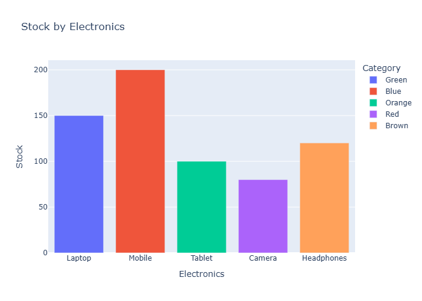
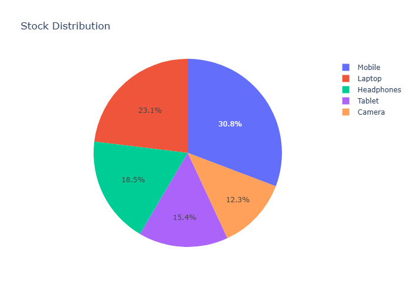
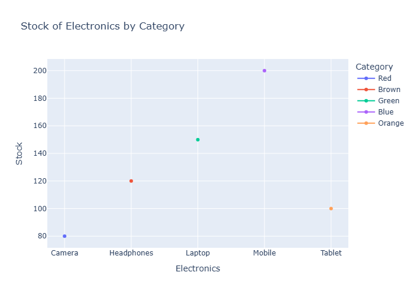
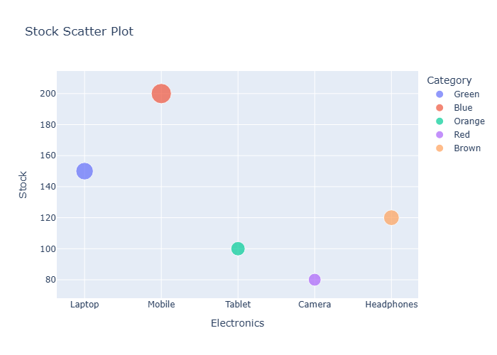
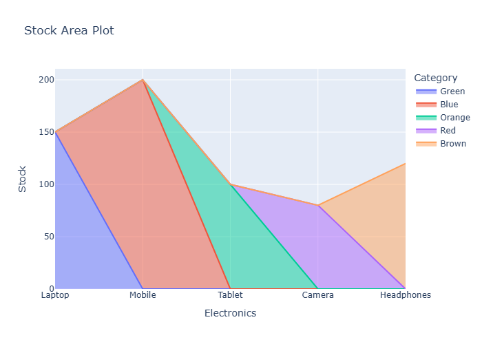
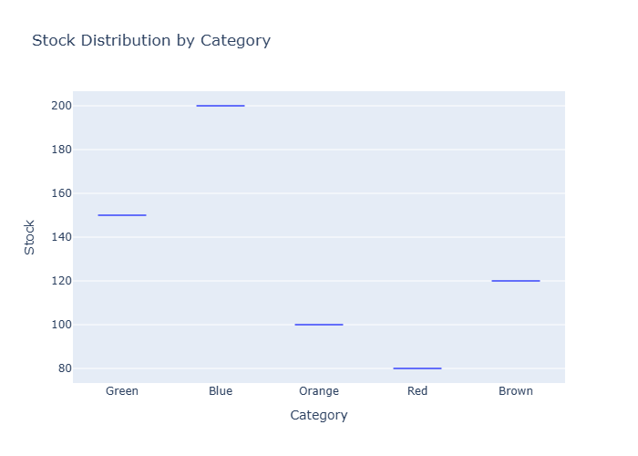
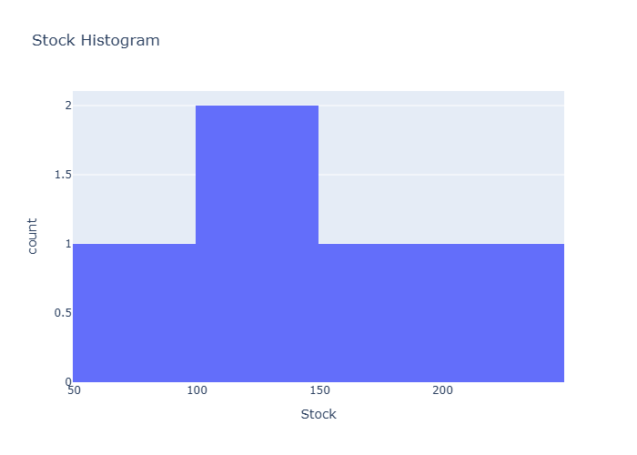
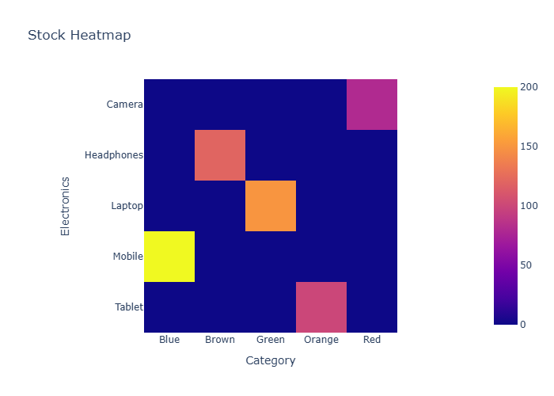
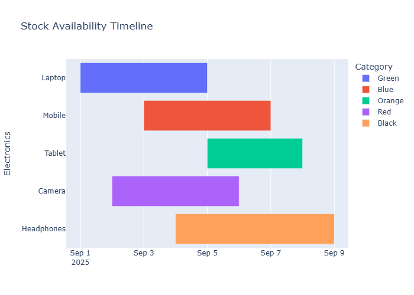

### Dash — Interactive Dashboards
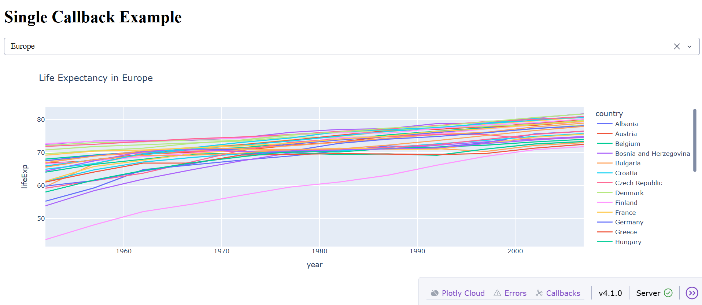
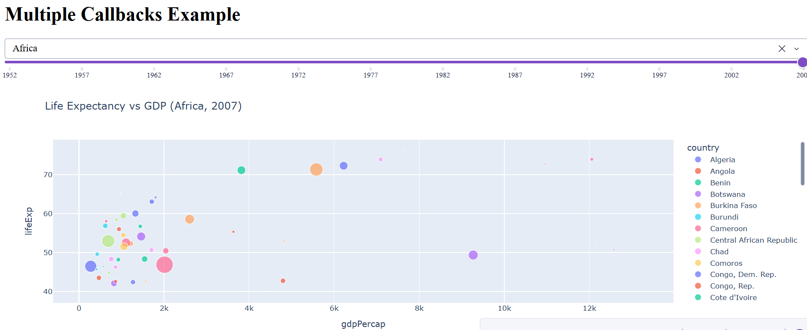
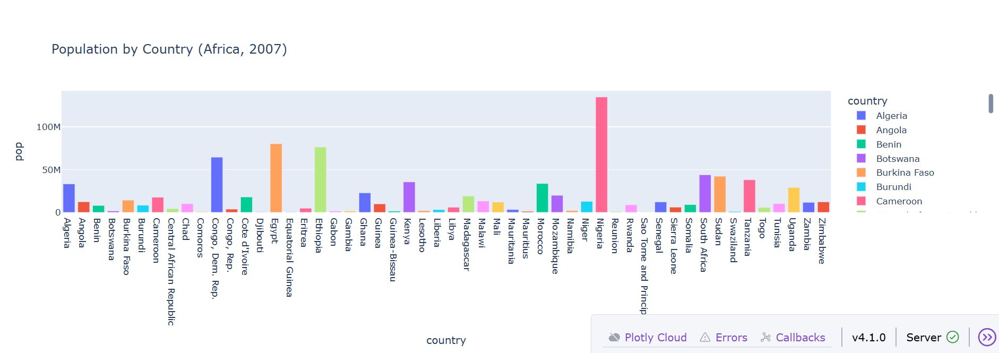

# Exploratory Data Visualization Research Suite

## Overview
End-to-end data visualization and analytics project using Python,
built as part of Data Visualization coursework at JAIN University.

## Tools & Libraries
Python | Matplotlib | Seaborn | Plotly | Dash | Pandas | NumPy

## Projects Included

### 1. Two-Wheeler Sales Analysis (Matplotlib)
Bar chart visualizing sales data for Hero, Honda, and TVS
representing 12.4M+ units across India's top 3 brands.

### 2. Palmer Penguins EDA (Seaborn)
3-chart EDA suite on 344 observations across 7 variables
demonstrating multivariate statistical analysis.

### 3. Interactive Plotly Dashboards
9 interactive charts covering bar, pie, line, scatter, area,
box, histogram, heatmap, and Gantt chart types.

### 4. Dash Interactive Dashboards
3 callback-driven dashboards with real-time filtering across
the Gapminder dataset covering 5 continents and 12 time periods.

## Screenshots

### Matplotlib — Two Wheeler Sales

### Seaborn — Palmer Penguins EDA

### Plotly — Interactive Charts

### Dash — Interactive Dashboards

